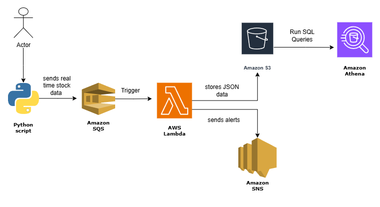

# 📈 Stock Market Real-Time Data Analytics Pipeline on AWS

A serverless data pipeline that ingests simulated stock ticks in real-time, processes and stores them for historical analytics, and sends automated alerts when anomalies occur — all built using **AWS cloud-native services**.

---

## 🛠️ Tech Stack

**Cloud Services**  
- Amazon SQS  
- AWS Lambda  
- Amazon S3  
- Amazon SNS  
- Amazon Athena  
- IAM & CloudWatch  

**Language**  
- Python 3 with Boto3  

---

## 🏗️ Architecture

### Flow of Data
1. **Producer (Python Script)** generates stock tick data and publishes it to **Amazon SQS**.  
2. **Amazon SQS** acts as a reliable buffer, ensuring event-driven ingestion and decoupling producers from consumers.  
3. **AWS Lambda** is triggered by new messages in SQS:  
   - Stores processed JSON into **Amazon S3** for long-term durability.  
   - Publishes alerts to **Amazon SNS** when stock prices cross a defined threshold.  
4. **Amazon Athena** queries structured JSON data directly from S3 for historical analytics without ETL.  

---

## 🔧 Why These AWS Services?

| Service        | Functionality                                                                 | Why We Used It                                                                 |
|----------------|-------------------------------------------------------------------------------|--------------------------------------------------------------------------------|
| **Amazon SQS** | Fully managed message queue for decoupled, reliable ingestion                 | Ensures no stock tick events are lost, scales seamlessly for spikes             |
| **AWS Lambda** | Serverless compute triggered by events                                        | Auto-scales with incoming data, no servers to manage, cost-efficient            |
| **Amazon S3**  | Highly durable object storage                                                 | Stores JSON stock records for long-term analytics at minimal cost               |
| **Amazon SNS** | Pub/Sub messaging for notifications                                           | Sends real-time alerts to subscribers when price thresholds are breached        |
| **Amazon Athena** | Serverless SQL queries directly on S3 data                                | Allows analysts to run queries on raw JSON without complex ETL pipelines        |
| **IAM**        | Identity and access management                                                | Enforces least-privilege access for Lambda to interact with SQS, S3, and SNS    |
| **CloudWatch** | Logging and monitoring                                                        | Provides observability for Lambda execution, errors, and system health          |

---

## 🎯 Project Purpose

### ✅ Why This Project Is Needed
- Real-time analytics is critical for industries like **finance**, **retail**, and **IoT** where data arrives continuously.  
- Traditional batch ETL pipelines introduce delays — this project demonstrates **event-driven, serverless data processing**.  

### ✅ Business Purpose
- Monitor incoming stock prices **in real-time**.  
- Store all events in a **data lake (S3)** for historical trend analysis.  
- Trigger **alerts automatically** when abnormal spikes occur.  
- Enable stakeholders to run **SQL queries on demand** without infrastructure setup.  

---

## ⚙️ Functionality

- **Real-Time Data Ingestion** → Python producer publishes stock ticks to Amazon SQS.  
- **Event-Driven Processing** → AWS Lambda consumes SQS messages and:  
  - Stores JSON in S3 (`processed/` folder).  
  - Sends alerts via SNS if thresholds are met.  
- **Historical Querying** → Analysts query JSON data directly in S3 using Athena SQL.  
- **Notifications** → Amazon SNS delivers instant alerts (email/SMS).  

---

## 📊 Example Use Cases

- 📉 Detect unusual stock drops and send alerts to risk managers.  
- 📈 Identify when stock prices exceed a trading threshold and notify traders.  
- 📊 Store years of tick data in S3 for future analytics and machine learning workloads.  

---

## 🚀 Outcome

- Designed a **serverless real-time data pipeline** fully on AWS.  
- Achieved **decoupled ingestion** and **event-driven processing**.  
- Implemented **automated anomaly alerts** via SNS.  
- Enabled **historical analytics** using Athena on raw S3 data.  

---

## 👩‍💻 Built By

**Sahithi Devineni**  
Master’s in Information Systems @ Saint Louis University  

---

## 📂 Repository & License

- 📂 Repository: [GitHub Link](https://github.com/Sahithid7/stock-market-analytics-pipeline-aws)  
- 📜 License: MIT  

---

